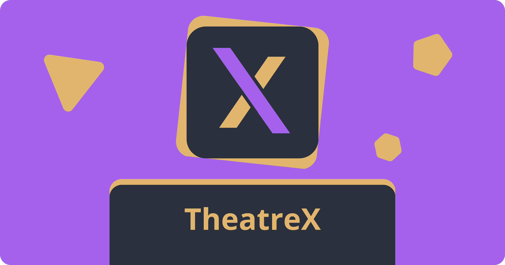

# TheatreX Desktop

Desktop Application of TheatreX.

TheatreX is a place to combine all your favorite streaming services into a single, unified experience.

## Features

- **Modular Providers** - TheatreX is built around the concept of providers. Providers are adapters that allow TheatreX to interact with different streaming services. You can write your own provider or use one of the existing ones. Providers can be hosted locally or remotely, anonymously or with authentication, and can be written in any language.
- **Personalized Experience** - Privacy matters. TheatreX keeps your watch history locally, so you can pick up where you left off without having to worry about your data being sold to third parties. It also allows you to create custom playlists, and share them with your friends with export and import functionality.
- **Cross-Platform** - TheatreX is available as a web app, so you can access it from any device with a modern web browser.
- **Comfortable UI** - TheatreX is designed to be as simple and intuitive as possible. Don't like the default theme? Try a different one of the many available themes.
